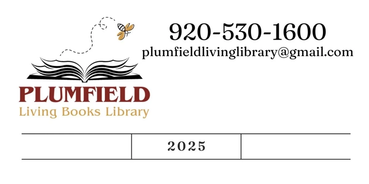
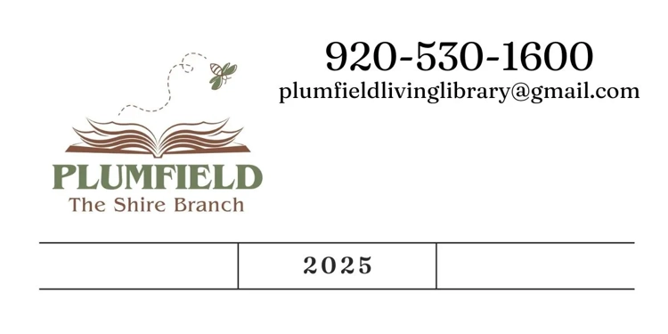
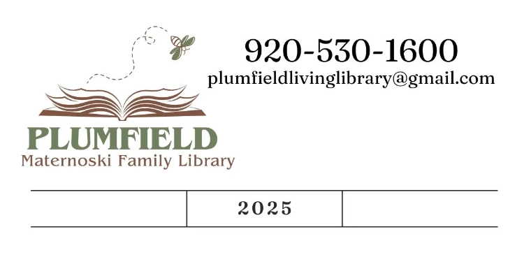
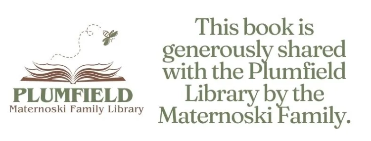

I wanted to share a little system we’ve developed at Plumfield Living Books Library that may be helpful to any of you who are thinking about expanding access to your collections—*without* opening additional branches.

As many of you know, we currently have one active branch, another planned for next summer, and a third in discernment. But I also know that most of you are not looking to establish branches. Still, something happened this week that made me realize there may be a middle path worth sharing.

A local homeschool mom reached out—not to become a branch, but to explore whether her excellent personal collection could be made available to our patrons. She will keep her books in her home, but I will catalog them in Libib as their own collection. From there, patrons will be able to request her books through our interlibrary loan system, just like they do with our branch locations.

To make this simple and clear for everyone involved, we are using the same sticker system that I use for our branches. Each collection—branches *and* homeschool partners—gets its own color. Some books at each branch are assigned from the main library’s collection, and some are books the branch families have purchased and generously shared. All of it needs to be easily identifiable and trackable, no matter where it lives.

Here’s how the labeling works:

## Every book gets a pair of stickers — one on the back and one on the front.

### 1. Back sticker
A 2×4” circulation label with the Plumfield logo, our contact information, a spot for the barcode, and boxes for shelving notes. The logo is printed in that collection’s color.

- If ***I*** own the book, the logo displays the branch name.

- If the ***family*** owns the book, the logo displays the family name.

### 2. Front sticker

A small “identifier” sticker in the same collection colors. This is especially helpful in case a book accidentally gets returned to the public library.

- If the book comes from my collection, it simply has my contact info.

- If it’s a family-owned book that they are sharing for circulation, that acknowledgement is printed right on the front sticker.

This has given us a clear, reliable way to circulate books that technically “live” outside the main library—whether that’s in a fully fledged branch or simply on the shelves of a homeschool family who wants to participate in the work.
I thought I would share this system in case any of you are considering partnerships with homeschool moms (or others) in your community and are wondering how to keep things organized, identifiable, and easily trackable. Happy to answer questions if anyone wants help thinking through a similar setup!