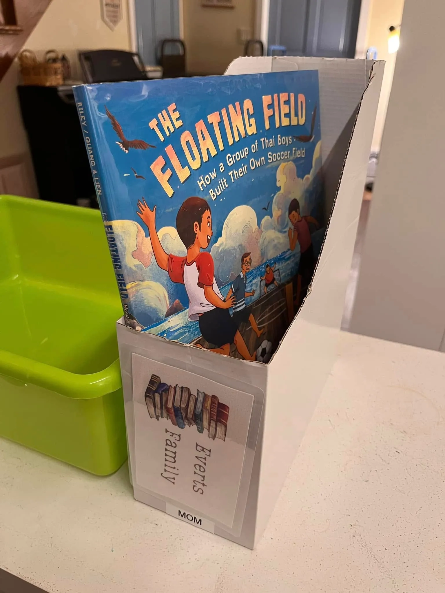
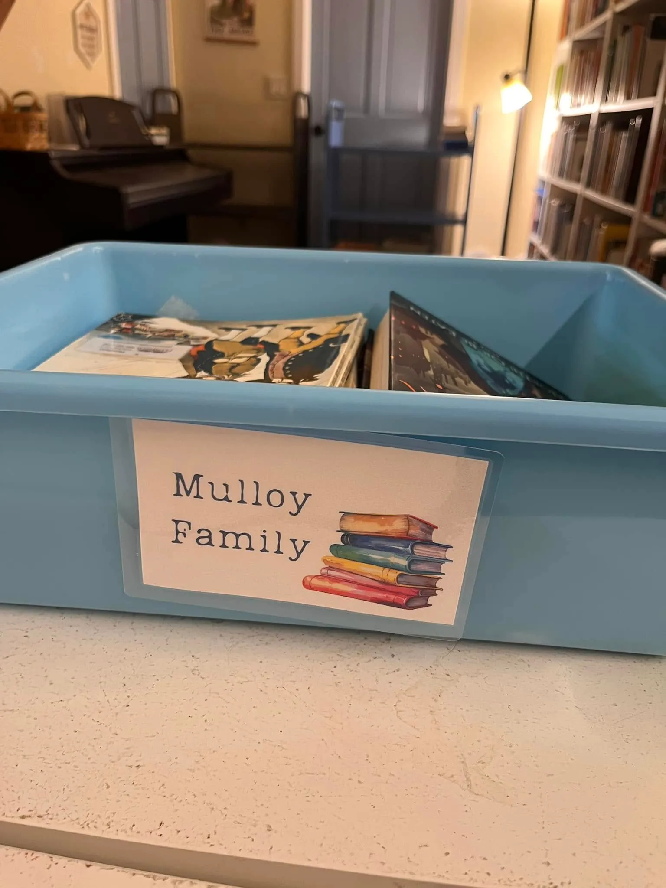

Here’s a little solution we came up with to make our holds and checkout process smoother on busy days—it’s quick, functional, and even a little fun.
We use LibraryThing, which allows patrons to place holds in advance. When a hold is placed, we pull the items and store them at our checkout station. Each hold sleeve is labeled using a laminated family name card, which attaches to the sleeve using Velcro dots.

On the day of their appointment, we transfer the family’s books into a checkout bucket and move their name card to the front of the bucket—ready for easy pickup.

We use the same system when families visit the library in person. They grab an empty bucket and place their name card on it before they begin browsing. No matter how many families are visiting at once, it’s always clear which bucket belongs to whom.
I designed the name cards in Canva, laminated them for durability, and used basic index cards for backing. This whole system has made our circulation workflow much more efficient—and it’s easy to reset at the end of the day.

**Supplies we used:**
- Bins: [Amazon link](https://amzn.to/3DRLas3)
- Velcro Dots: [Amazon link](https://amzn.to/402uCEY)
- Laminating Pouches: [Amazon link](https://amzn.to/40pdTNM)
- Basic index cards