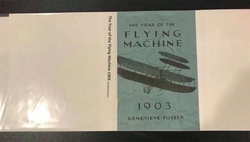
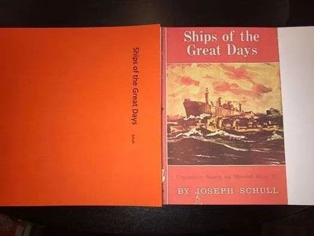
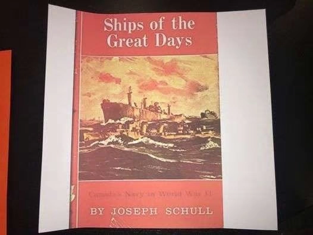

*The pictures and much of the information is taken from a Facebook post by Sandy Hall, Hall’s Living Library, GA.*

To make your own book jacket that will cover, beautify, and protect a jacket-less book, try the following steps.

**Step One:** Find a cover photo online of the book’s original cover art or make your own cover art for the book. Resize the photo or artwork to fit the cover of the book and print with a high resolution printer. Trim the top and bottom edges to fit the book’s front cover exactly.

**Step Two:** Choose a color of acid free cardstock or paper and print the title/author on it. Then trim it to fit the book’s height and align it (trimming some off if needed) to the cover paper so that the title will fit along the spine. Use acid-free glue to adhere it in place.

**Step Three:** Cover the new book jacket with Mylar plastic as normally done for regular dust jackets.

