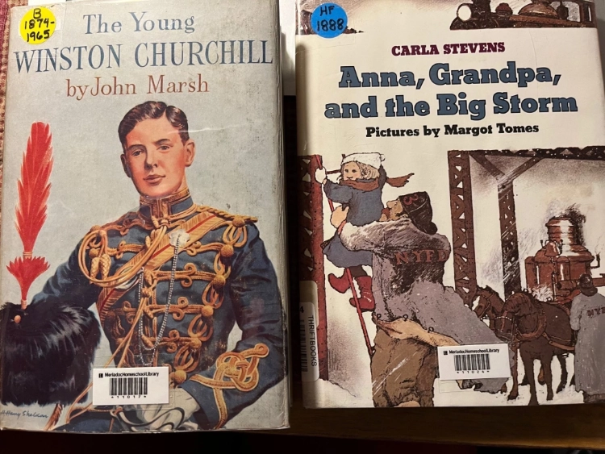

*From Mary Schubert of Pursell Schubert Legacy Library in Oklahoma:*

There are many ways that you can label your books. I use the Avery Return Labels [Avery Easy Peel Laser Address Labels, 1/2″ x 1 3/4″, White, 2000 Labels Per Pack (5267) \| Staples](https://amzn.to/49DVEXY) for my library name and label identification. Since I do not have a barcode set up yet, I went with the smaller labels for my library information, so that I could later add a small barcode next to my library label. Some libraries use a larger label that has both the library name, the book barcode and incorporates the spine cataloging label all in one. For my spine labels, I have a box that I ordered several years ago from **Online Labels**. [Blank & Custom Labels \| Online Labels®](https://www.onlinelabels.com/?branded=true&gclid=CjwKCAjwoZWHBhBgEiwAiMN66bVNw1vz7VnvQM0VH8LgBreNuab9rXQL8wcw5hrCzs-YtGNrc7X1IBoC0jUQAvD_BwE) (Mine are a small square size I think.) It is my intention to use these once I start labeling the spines of my books with my call number system. (By the way, LibraryThing has an option for adding your own call number to books you record there.) I have seen some creative ways that spine labels have been put on, and the most recent was one where the information was typed out lengthwise and then the label turned sideways, but the book was a skinny spine, and you could actually read all of the information. I liked it.

When it comes to subjects, some librarians who do not use Dewey Decimal Numbers will use a color-coded sticker for either their subjects or to mark centuries for history. You can purchase these small colored dots from the library stores, or you can make your own with **Avery multi use labels** [Avery Multi-Use Labels, Removable, Handwrite Only, 1/2″ x 3/4″, White, 525 Labels (16737) – Walmart.com – Walmart.com](https://amzn.to/3OX6dvm) that are more readily available from Wal-Mart. Then color them with highlighters or other colored markers. I also saw a little **musical note** sticker above the spine label of a book I recently acquired. It struck me that you could make your own small subject notation markings or pictures and just print on paper if you did not want to print on stickers. Or do multiple ones on the Avery Return labels and cut apart, probably get three per sticker. A visual notation sticker might be helpful if you are not able to make enough colored dots. Not everyone does colored dots for subjects. I think some just use a green colored dot to show an easy reader book, since they house all reading level books for one subject together, instead of some in an easy section. Others use a colored dot for marking historical fiction books that are housed with their non-fiction books history books.

*From Sherry Early of Meriadoc Homeschool Library in Texas:*

If you use barcodes for identifying and checking your books in and out, you can place these barcodes in any place you want on the book. I put mine at the bottom center on the front cover because I want them where I can see them. I do try not to cover author or title information when I place the bar code sticker on the book. I cover each barcode sticker with Scotch Book tape to protect. (You can buy clear label protectors, little clear stickers, from a library supply company, but they are expensive and book tape does the job just as well.)

Call number labels should go on the bottom spine of the book. I began, and have continued, to put my call number labels on the top left hand corner of the front cover of the book, but I do NOT recommend this placement. I did it because many children’s books are thin, and the entire call number doesn’t fit well on the spine. Also I didn’t want to try to remove all of the spine labels that were already on many of my ex-library books, so I decided to just ignore them and put my call number on the front cover. This was a mistake because now I often have to tilt the book out of the shelf to see the call number so that I can shelve returning books. This tilting and pulling books out of the shelf produces more wear and tear on the spines and more work for me. So learn from my mistake. Put your call number or spine label on the spine, or just to the right of the bottom of the spine on the front cover if the book is too thin to take a spine label.

I use colored dots, as pictured to give each book a call number or “book address.” Historical fiction has a blue dot with the abbreviation HF and the year in which the book takes place. Biographies (B) take a yellow dot with the years of birth and death for the subject. I just write these labels myself with a fine-tipped Sharpie marker and cover each one again with Scotch book tape. Histories have a green dot label with the year that the book begins, and all of my books in other categories have a red dot with the abbreviation for the shelf category that the book belongs in: MUS for music books, ZOOL for zoology books, etc. You can read more about my classification system and those of other librarians in other articles in this series about organizing and shelving science books, history books, biographies, and more.