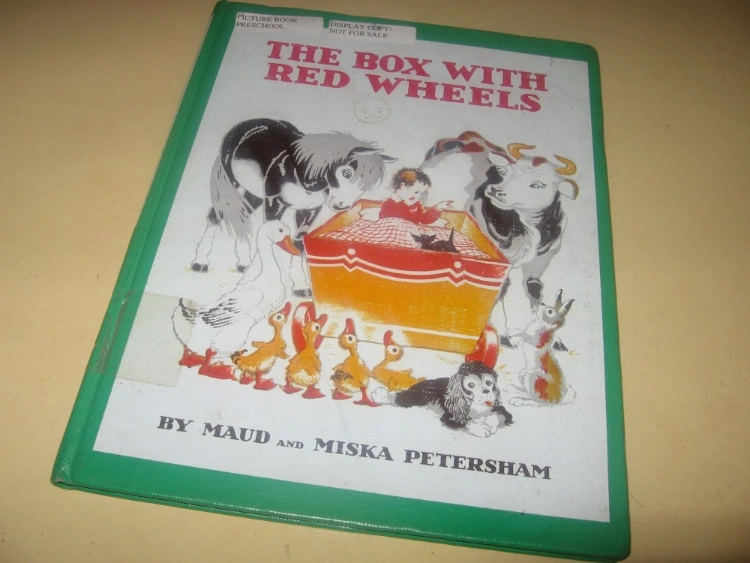
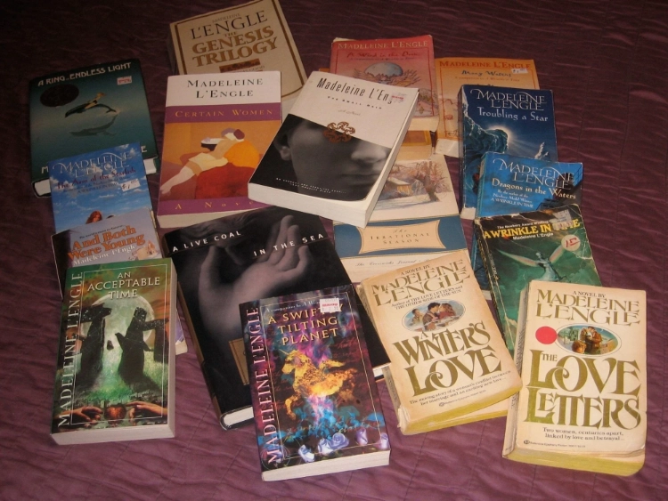
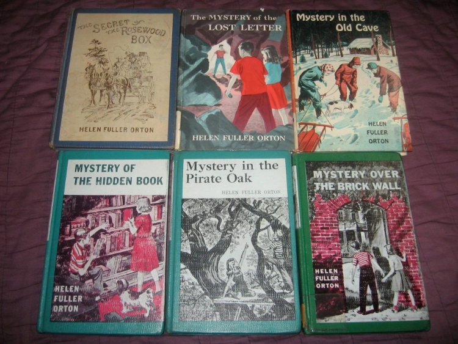

> binding: the outside cover of the book and the way the pages are held together

- library binding or library bound: a book that is in its initial publication specially bound for libraries with pages sewn in place and a reinforced spine.
- library rebound: a book that has been sent to the bindery to be rebound with a new reinforced spine and cover. The covers are generally made of buckram, coated with acrylic, and printed with the cover art on the cover itself.
- turtleback, turtle bound, perma-bound: a specific type of prebinding or rebinding that takes paperback books and fits them with lightweight, plastic-looking, but sturdy covers and reinforced spines.
- trade binding or trade publication: a book, hardcover or paperback, that is bound and published to be sold in bookstores to the general public. Typically, these books are glued together, not sewn.
- mass market paperback: paperback books that are designed to be sold in all sorts of venues at a less expensive price than either trade paperbacks or hardcover books. Mass market paperbacks are usually smaller than trade books and may be printed on inferior paper or glued with cheap glue.

There are many more terms and materials for covering and binding books–leather bound, cardboard covers, cloth bound, and more. But these are some of the most frequently used, and confused, in libraries and in the general book trade.
[You can read more details about library binding in this Wikipedia article.](https://en.wikipedia.org/wiki/Library_binding)

## Library rebound book

The problem with all of these terms, however, is that they are not used by the same people to mean the same things. Paperback books are rebound by several different companies using different processes, and some libraries and librarians prefer one company’s process, some another. Trade binding can be well done or poorly done, depending on the publisher and the printer. Mass market paperbacks can hold up to long wear or can fall apart after only a few readings.

## Mass market paperbacks, possibly some trade paperbacks

Generally, original library bound books are more durable than library rebound books because they are newer and have not been cut apart and put back together in the rebinding process. But library rebound books are quite sturdy because the covers are tough, and the reinforced, sewn spine is tight and secure. Turtleback or Permabound paperbacks will last much longer than regular paperbacks because they are water resistant, and the covers will not tear or crease. However, these rebound paperbacks are still only glued together, and they will break or lose pages over time. They can also be difficult to open completely flat or near flat, making it hard for the reader to enjoy the experience of reading the book. Trade paperbacks should be stronger, with better quality paper than mass market paperbacks, but again, that quality and durability may depend on the quality of the publisher or printer.

## Four library rebound books, with two (top right) in original trade binding

As a rule, choose the best binding with the toughest cover that you can find or afford for library lending. But a cheap, fifty-cent used paperback that will still serve several readers may end up being the best value until you can find something better.