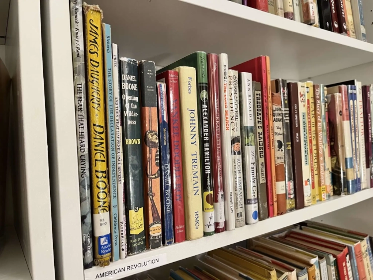
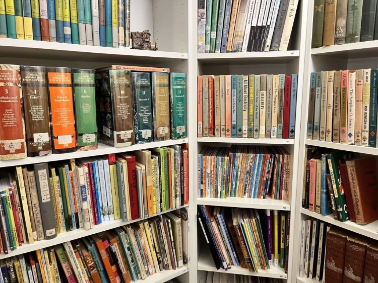
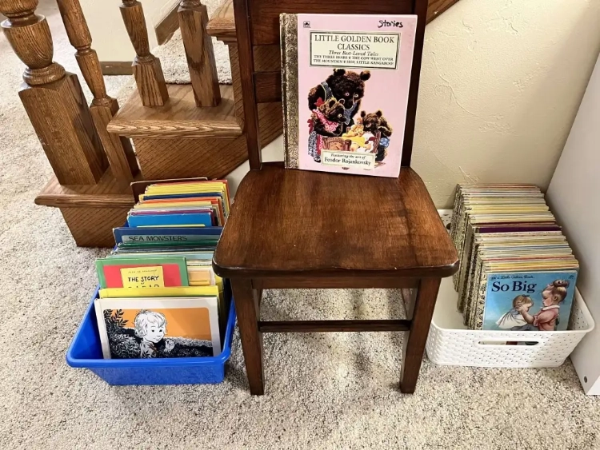
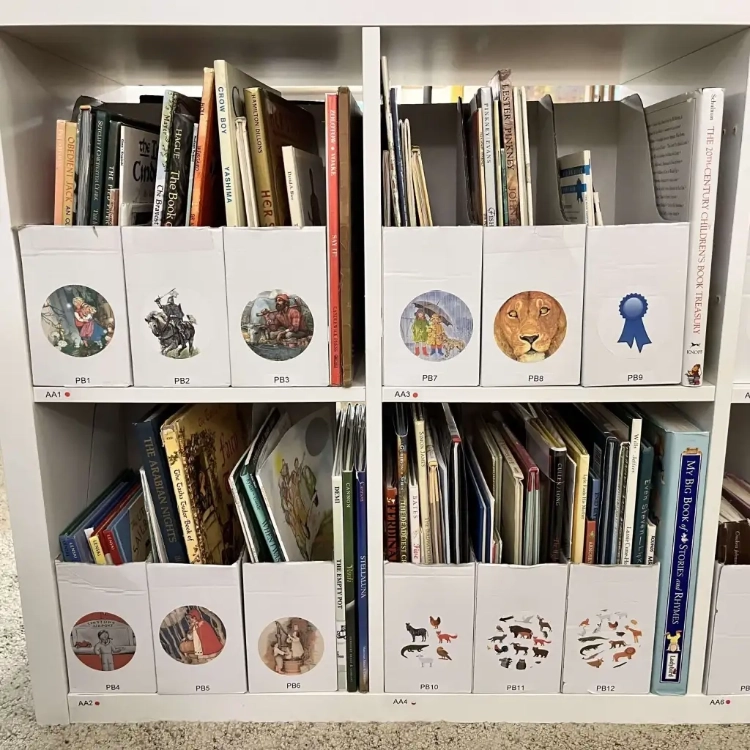
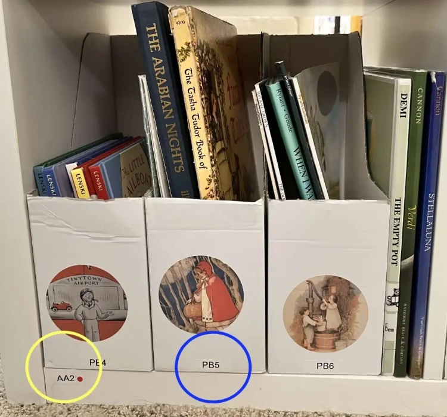

*From Librarian Sara Masarik, Plumfield Living Books Library, Wisconsin. Written in 2023.*

When I opened my library I did not have an extraordinary number of picture books. Not knowing that I was going to open a library someday, I gave most of my picture books away over the years. I kept the best ones for the future, but as my children aged out of them, I shared the rest with friends to make room for my growing collection of chapter and middle-grade books. Because of that, when I set up my library, I decided to organize my picture books differently than most of the other librarians I was following. And, so far, it’s been working really, really well for us.

First, any picture books that can be integrated into history are on the history shelves – right next to their corresponding Landmark or Cornerstones of Freedom type book. Shelving them there is a bit awkward but effective. Patrons have loved being able to settle in front of a time period and just pull the correct themes and levels for their intended course of study.

Second, any picture books that are obviously science-related are shelved in our science and wonder section. At this point that section is not yet organized. (Next project once history is done!)

Certain small series like Little Golden Books are all together in their own series-specific basket. I find that my youngest patrons know that this library is for them because these baskets are on the floor and easily accessible – right where they can play with them. They head down my stairs holding mom’s hand and then break free to go find their favorites.

For the bulk of my picture books, however, I have them grouped in ways that make sense to me – by favorite author, illustrator, or theme. There is no system to it. Just a decision that my daughter and I make together that makes sense to us. Then, for ease of organizing and finding, we have the grouped picture books shelved in magazine files and housed in Kallax cubes. Each magazine file contains the same kind of picture books (e.g. all Lois Lenski, or all dogs, or all Purple House Press reprints or all fairy tales). Each of those files is labeled with a code, and then all of the books in that file are tagged with that code in our LibraryThing/TinyCat software. Additionally, each cube has its own code. For books that are too large to fit in a file, we shelve them in the extra space and tag them with the cube code. When a patron asks for *Cowboy Small,* we just go to cube AA2 and pull file PB4.

I decided not to invest in sturdy magazine files until I did it this way for a year or so. Because I am a new librarian, I worried about investing in something that may not work out well. The IKEA magazine files were about \$.79 for two (I think that they have gone up to \$.99 now). I decided that \$25 in cardboard files would give me a usable option for a year. Now that we have been doing this for about six months, I am not sure that we would ever upgrade. These work quite well and we can replace them as necessary without any real expense. [If you do not have an IKEA near you, these on Amazon are very similar.](https://amzn.to/46LIANo)

We get a lot of questions about how we labeled our Kallax and the files. We have a [hand-held Dymo label maker](https://amzn.to/3PYp9KA). It has been fantastic and typically does not remove the finish from the IKEA shelves when we have to change the label.

Everyone always asks about the stickers on the files. We made those. We worked to source free images that we could use. We do not sell them because they are a bit of work to produce and I would rather spend my time taking care of my library. You can find sellers on Etsy who sell similar things.