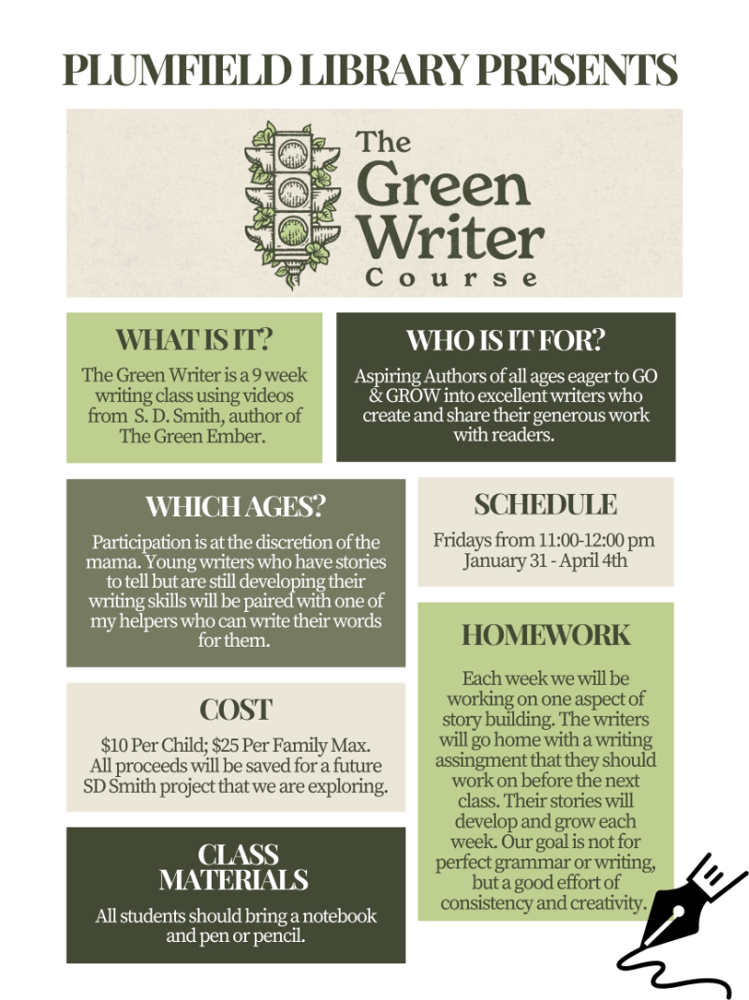

If you’ve been around here for any length of time, you’ve probably picked up on the fact that we are big fans of *The Green Ember* author S. D. Smith—and of just about everything that flows out of Story Warren. From *The Green Ember* and *Jack Zulu* to [*Mooses with Bazookas*](https://plumfieldmoms.com/plumfield-moms-book-reviews/mooses-with-bazookas) and [*Found Boys*](https://plumfieldmoms.com/plumfield-moms-book-reviews/new-book-the-found-boys), we deeply admire Sam Smith’s heart for children and his commitment to creating stories that speak truth, beauty, and goodness. His writing is thoughtful, courageous, and always full of hope. And it turns out—he’s just as good a teacher as he is a storyteller.

When *The Green Writer* video course launched in 2021, our family (Sara’s family) jumped in immediately. Then we did it again with friends the next summer. This past fall, I adapted it for our library and taught it as a 13-week class—and now we’re gearing up to do it again this spring. We. Love. *Green Writer.*

## So, what is *The Green Writer*?

It’s a 13-session streaming video writing course, taught by Sam Smith himself. Each video is short (about 5–10 minutes), and includes a few thoughtful questions and an imaginative writing prompt or two. Sam makes the sessions fun, approachable, and—perhaps most importantly—not intimidating. His style is funny and direct, and he breaks down storytelling into simple, repeatable habits that build confidence in even the most hesitant writer.

In my experience, nothing else we’ve tried has been so effective at encouraging young writers to simply *write*. This program is not about grammar and spelling drills (though those are important in the right context). It’s about discovering the joy of storytelling, identifying your audience, and practicing the art of getting your ideas out of your head and onto the page.

## Who is it for?

The Green Writer is best for independent readers and writers, but I’ve also seen success with kids as young as six, especially when paired with a parent or older sibling who can act as a scribe. It’s a flexible program that can meet kids where they are, and grow with them over time. My own children have gone through it twice now—and I’ve loved watching them become more confident, expressive, and brave with their writing each time.
The best part? You can try out a few of the lessons for free. And when you’re ready to purchase, you can use this link and code `WRITENOW` for \$10 off:

👉 [The Green Writer Program](https://greenwriter.sdsmith.com/a/aff_3z9n5zfg/external?affcode=897354_yvxarlgl)

## Taking It Further

When I met up with Sam and his brother Josiah in Chicago this summer, I shared my idea of adapting the course for small group use in our library. As always, they were incredibly supportive. With their blessing, I designed a 13-week class that has now become a favorite part of our library programming.

To make the course even more accessible in this setting, I created a companion workbook to go with each session. It’s simple, pretty, and easy to use. If you purchase the program and send me your receipt, I’d be happy to share our workbook with you—free of charge. (When you do, you’ll also be signed up for our newsletter.)

Just for fun, here are a few of the illustrated covers my son Jack created for the students’ short stories last fall. Watching the creativity and storytelling come to life in our group has been such a joy.

Learn more about the program and how to get started:

👉 [Plumfield Moms on The Green Writer](https://plumfieldmoms.com/green-writer-program)

More updates on how we’re using *The Green Writer* in our library are coming soon, including a new mini-one day-intensive that we are testing this summer. 

Our last day of the fall class: [https://www.instagram.com/p/DCZ0hDbSWnC/](https://www.instagram.com/p/DCZ0hDbSWnC/)