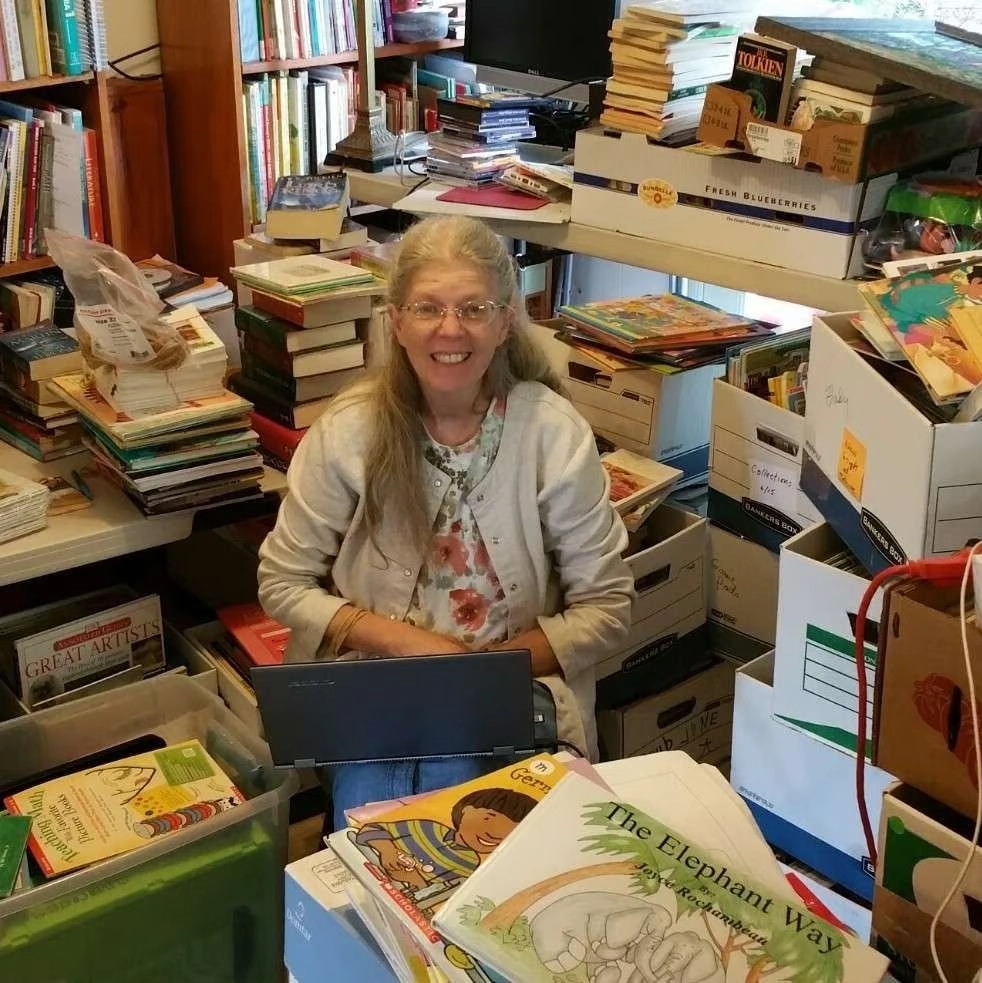
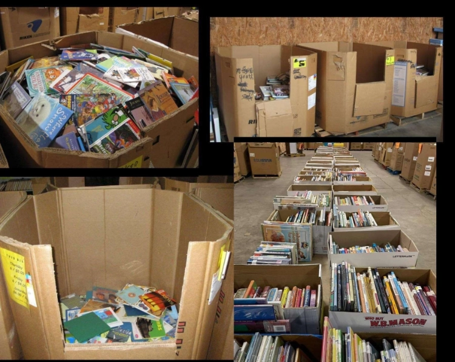

*An interview with [Kristi Stansfield, aka Tarpfarmer](https://marylandlibrary.super.site), of Maryland Living Books Library, edited by Diane Pendergraft*

### What is a Tarpfarmer?

<iframe data-testid="embed-iframe" style="border-radius:12px" src="https://open.spotify.com/embed/episode/3JvAs4RiT7pGSe13s0B9Et?utm_source=generator&theme=0&si=617157672ab648a3" width="100%" height="352" frameBorder="0" allowfullscreen="" allow="autoplay; clipboard-write; encrypted-media; fullscreen; picture-in-picture" loading="lazy"></iframe>

I’ll answer this question first, because it’s easy. In the 90s when we moved to New Hampshire for my husband’s work we ended up with a sort of animal farm. All I was doing was buying fresh eggs from a farm along the road on the way to town. That innocent contact ended up with us owning pigs, guinea fowl, ducks, geese, turkeys, rabbits, pet and milking goats, and various batches of egg laying, pet or meat chickens over the course of the five years we lived there.

In the good old New England way, we scrounged for building materials at the dump instead of buying new (that’s another story), but we didn’t need permanent buildings for some of the more temporary residents. So, my engineer husband built wooden frames covered with blue tarps for the rabbit and turkey houses. He named it the Tarpfarm, and I’ve been tarpfarmer ever since.

### How did you start lending books?

I started informally lending to family, church friends, and homeschool moms by bringing bags of books to church, a meeting or family gatherings. Most of the time I remembered who had what, but it was always fun to have something returned that I had forgotten was gone. Somehow the books always got returned to me... eventually.

I always had the idea of an official lending library in the back of my mind, and I would trot that idea out when people asked me why I bought so many books. Sometimes people would ask me if I was a teacher or a librarian, and I would say “yes” to the first and “Librarian Wannabe” to the other.

I also have known from the beginning that having people in our home to visit the library would not be an option, so finding and maintaining an online catalog was a #1 priority. [Readerwar](https://www.readerware.com/index.php)e and [LibraryThing](https://www.librarything.com/) have been a huge blessing.

*Kristi in the library*

### How do you run your library? Do you have regular days or hours?

A few years ago, probably in self-defense, my husband installed a 12' x 26' building next to our house, finished the walls, and provided electricity for the lending library. Life intervened with some unforeseen events, and I’m still setting up the library with a goal of it being officially open to memberships in 2024.

Currently, lending is by appointment only. I call this the beta testing time as I finish cataloging and shelving the books I own. I send my catalog link to patrons, and they either email a list or share a document with the books they would like to check out. They either come to my house to pick up the books or I will meet them at an agreed upon location. The library has way too many books (many still in boxes) in the building to allow for patron families to safely browse and check out books. That is why my primary goal is to maintain and update my catalog and shelve the books, so they know what is available to borrow, and I’ll be able to find them.

### Do you charge a fee?

At this time, I do not charge a fee because the library is not totally functional. When I do charge a membership fee the beta testers will receive a reduced fee for the first year. All members will receive, at no additional cost to them, a Biblioguides membership as part of the membership fee. The purpose of the fee is to demonstrate the value of the library and to defray some of the operating expenses. My plan for the fee is Beta Testers, \$60 per year for the first year and \$120 per year for the second year and continuing. That will include a Biblioguides membership. New memberships will be \$120 per year.

### How do you catalog and organize?

Before the internet I used a desktop application called Readerware. I realized at the beginning I would like to eventually have an online catalog, so when LibraryThing came online in 2005 I imported my Readerware catalog of 5,000 books into LibraryThing, and I’m still there. I still use the Readerware software as a “hard copy” offline backup of my online catalog in case the internet is out for a period of time.

I love to tag my books with topics found in the collection of other member tags to help patrons find what they are looking for. My library is loosely organized by genre while I’m cataloging, unloading boxes, and shelving. Science, history by time period, biographies, fiction, picture books are the general locations. Eventually I would love to have the history, biography and historical fiction all together chronologically, but first I need to know what I have so people can borrow it. Also in the plan is to put a barcode on each book and use a scanner for easy check in and out, but for now I just take pictures of the covers and spine stack and check them out by hand.

### What is your philosophy on collecting?

Now THAT is an awful question! I know I must have one, but it might sound pretty awful if I said it like this: Buy all the books you can, all the time that you can, because you never know if you’ll pass this way again. I know I’ll never regret having all the books I do, but I would regret not having them because I put some artificial limitation on myself other than the real-life ones like money and location.

The motivation is one of helping, of seeing a need and trying to fill it or figure out how it can be filled. That’s how I mostly see the library, although I’m probably more attached to the books than I want to think about, but that will become more apparent when more than one or two patrons are regularly borrowing.

*When Kristi goes book shopping...*

### How do you decide what a good book is?

This is another hard question, now made easier by the availability of research tools. At first I collected what I had read and loved as a child. Then at yard sales, thrift stores, sales and bookstores I started buying books that looked like the ones I loved. My daughter was a reader like me, and we collected together. She would read some of the books I found and rate them. She didn’t like to write (like me), but she knew good writing when she saw it and didn’t hesitate to say so.

Then literature based homeschooling curriculum came on the scene, and I started collecting books featured in those. Homeschool conventions allowed me to see many of the current and newly republished oldies, but it was the advent of [Valerie’s Living Books website](https://web.archive.org/web/20190829232005/http://www.valerieslivinglibrary.com/) (archived), [Jan Bloom’s book](https://booksbloom.com/jans-books), [Who Should We Then Read?](https://booksbloom.com/jans-books), and [Michelle Howard’s Truthquest guides](https://www.truthquesthistory.com/) that opened the window to the older living books, especially nonfiction. I still have the binder with all the printed pages from Valerie’s site, and other lists.

Now LibraryThing has become a wonderful research tool because I can search other member Librarian’s catalogs when I’m trying to decide if I want to buy or keep a particular book. Michelle Howard’s Living Book Database is another wonderful research tool.
