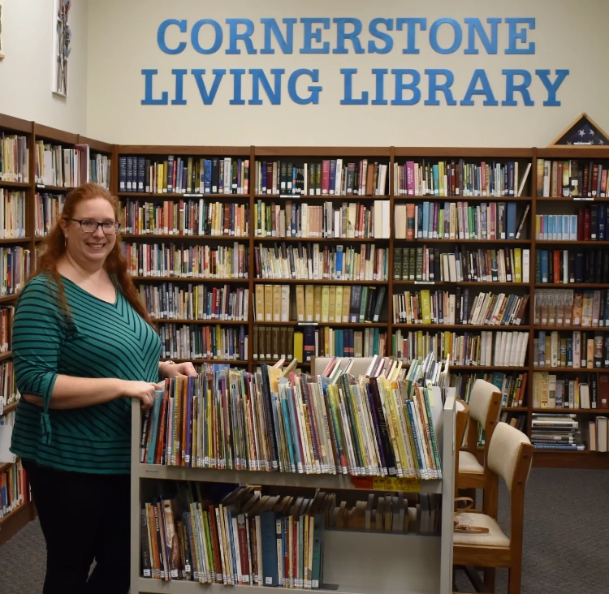

*From Ashley Borrego,[Cornerstone Living Library](https://cornerstonelivinglibrary.com/), Lilburn, Georgia*

I have always been an avid lover of books and reading. My childhood was spent with my nose continually in a book, lost in another world. I lived overseas for much of my childhood where the easiest access to English books I had were various private collections from the 1950s and 60s. I fell in love with those old treasures which now, as an adult, I realize was such a wonderful and unique opportunity for a child born in the 80s.
When I was in college, I worked in the acquisitions department of my university library and learned a great deal about how books are processed for circulation. What I learned then ended up being invaluable for my library now!

After college, I got married and we had three daughters, who I decided to homeschool. After doing some research (I love doing research), I landed on a literature-based curriculum for my girls. I immediately set out to see how many books we could find at the local public library. I was so surprised at how few were in the county library system. Where were classics like *Jenny and the Cat Club* or stories by Thornton Burgess? Why did they have modern-day spinoffs of *Misty of Chincoteague*, but only the first one of the original series by Marguerite Henry? Why is the library full of books that seemed to have little literary value, and so few older books?

I decided to start building my home library so my kids would be able to grow up with these beloved treasures. I shopped mostly at thrift stores and used book stores, and was pleased with the little collection I had built. The first exposure I had to lending my books was during COVID – the public library system shut down completely for four months, and I lent books to friends whose kids were stuck at home and desperate for new reading material. Then last year, I was listening to a podcast lamenting the state of our public libraries, and I thought to myself, “What we need is a private alternative to public libraries, where you could find the rich classics.” My thoughts immediately shifted from “Someone should do something” to "I could do something."

I didn’t necessarily like the idea of having the library in my house for a variety of reasons. I thought about the church we had started attending about a year earlier. They had a library there, but it was out of date and mostly unused. I had explored it with interest in the early days of attending the church, but found it mostly to be nonfiction adult books that didn’t tempt me much. It was in a beautiful room, though – high ceilings and lots of natural light. It would be a perfect location for a community library!

It took about six months from the first time I suggested the idea to the church leadership until they approved it as a new ministry that they would support and finance, with me as the volunteer director. During that time, I did a considerable amount of research on how to run a library. I had to make a detailed plan, create a realistic budget, and made multiple presentations to various groups within the church. In the course of my research I met someone who would become one of my biggest encouragers – Sandy Hall of Hall’s Living Library. Sandy runs her own library about an hour away from me, and she is a wealth of information. It was a pure pleasure to visit her library and hear all the good and the bad, and overall be encouraged in everything I was doing. Sandy is an inspiration to me, and I aspire to one day be like her!

Once the living library was approved, I spent the next five months getting it built to the point of being able to open to the public. I started with the existing library. I estimated there were about 4,000 books, with only about 500 of them geared to children (all Christian fiction written in the 70s and 80s). I did a lot of culling. We had books on how to talk to your teenager (written the year I was born), how the end of the world was going to come before 1990, and a guide to Christian colleges from 1986. There were a lot of great books, too, but in order to highlight those we needed to remove the out of date ones.

Simultaneously, I set about to add a children’s section. Sandy again helped me out – I bought close to 600 books from her! I also shopped thrift stores and book sales, as well as donating a portion of my own personal library. It was a long and tedious process to get the books ready for the shelves, and I thankfully had a team of volunteers who helped me. We officially opened our doors in August, 2023 with close to 7,500 books! We’ve only been open two months and have had 17 families actively using our library, both from within our church and from the community. Part of my vision has always had a community-building aspect to it, so we are also offering story times and other events.

I truly believe that private lending libraries are essential to preserving quality children’s literature, and I’m excited to see them growing in number around the country and world. I hope this is only the beginning of a long-lasting trend!