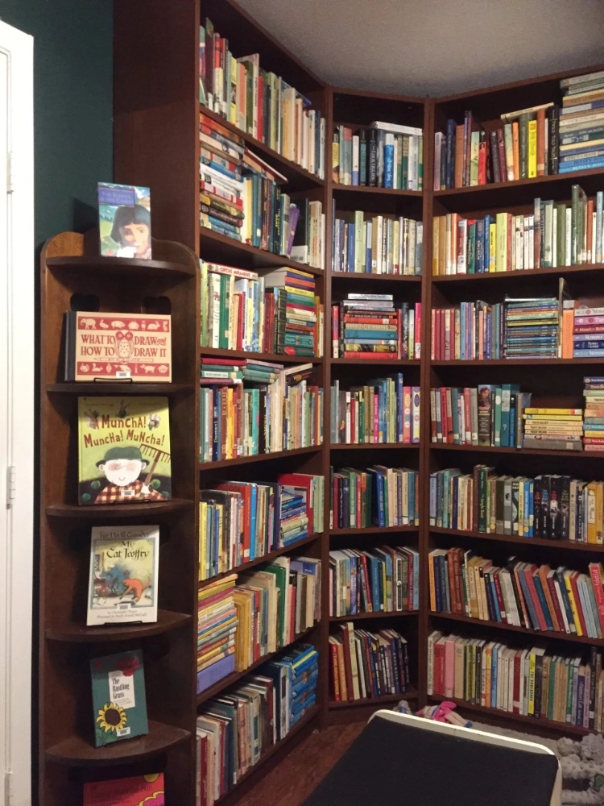

*From Sherry Early, Meriadoc Homeschool Library, Houston, TX*

I suppose I was born to be a reader and a librarian. After I learned to read in first grade, I was insatiable when it came to books. And the public library, Tom Green County Library in San Angelo, Texas, was my source. We were only allowed to check out ten books at a time, and so in the summer, when I finished my ten books within two or three days, I would beg my mother to take me back for more. The Children’s Librarians there, Ms. Karen, and later Ms. Lynn, helped me find the best books and inspired me to want to do the same for others someday.

Fast forward to me as a young married woman with no children yet in Austin, Texas where I was pleased to discover that the University of Texas had a graduate school in library and information science. And I applied for and got a scholarship! There I learned some of the nuts and bolts of library organization and book selection and cataloging, but I really learned to be a librarian, first from Ms. Karen and Ms. Lynn, and later when I became a school librarian myself. It was so much fun to be able to use other people’s money (tax dollars) to buy lots and lots of good books for my school libraries–and then to put those books in the hands and hearts of children.

After a few years as an elementary school librarian, I retired and moved to Houston with my Engineer Husband and our first child. Books were a part of our home from the beginning, and as I went on to homeschool eight children, we collected more and more books, some good, some excellent, and some admittedly disposable after one read. When my youngest entered high school and had outgrown most of the picture books (although we all still read and quote the *Frances* books by Russell Hoban and *Frog and Toad* by Arnold Lobel), I didn’t want to get rid of the good ones. So I sorted through and kept the best and decided to open a library. With no grandchildren at the time, I just couldn’t see the books sitting on shelves or in boxes with no one to read them and love them.

That was nine years ago, in 2014. The library started out in one small room, grew to two connecting rooms, and now occupies three rooms of my house in suburban Houston. As the children moved out, the books moved in. The library, now called Meriadoc Homeschool Library after my favorite character in *The Lord of the Rings* by J.R.R. Tolkien, became an excuse to collect more books, a magnet for book donations, and a source of joy for me and for my patrons. I began with two or three patron families, friends who decided to support my crazy idea of having a library even though the public branch library is only a couple of miles away from my house, and now I have approximately 30 member families, including two of my children who have given me seven grandchildren in all. All of the grandchildren are, of course, destined to be readers.

As all of us have our quirks; I do things a little differently in my library. I don’t have any fines or due dates for the books I check out to member families who pay \$60.00 per year to join my library. I ask the families to please return their books as soon as they are done with them so that others can enjoy the riches, and for the most part they cooperate beautifully. I don’t limit anyone to only ten books at a time, and some members check out thirty or forty at a time. Others only borrow two or three books each time they visit the library. The library is open three days a week, Mondays, Tuesdays, and Fridays, and I wish more people came on all those days to keep me company and to justify opening on three days. Many of my patrons place books on hold using my catalog at TinyCat (LibraryThing) and just pick up and return their books from the front porch, especially since Covid days. I miss the human interaction.

My library has become my main occupation and calling since I’ve retired from homeschooling. With grown children and a retired Engineer Husband—who builds bookshelves and other furniture as a hobby!—I am blessed to have this library as both a work and a ministry. There are more books being published in our day than ever before, but the good books are being discarded, hidden, shunted aside, and lost in a Sea of Books, some good but most of them ephemeral and rather silly. Some of the most lauded and advertised are even harmful and damaging to young minds. As I see what is happening to good books in our culture, our bookstores, and our public libraries, I am compelled to consider this library as a rescue mission and a way to honor the Lord and bring the best books, books full of good ideas and beautiful stories, into the world of children and of adults who use my library.