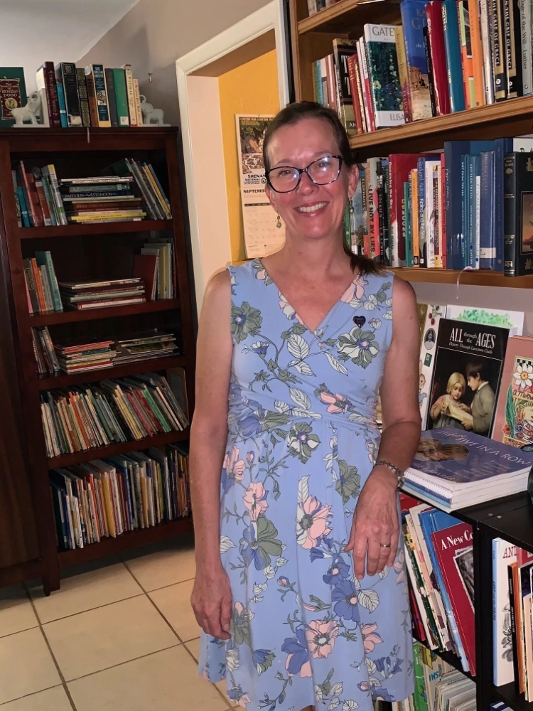

*From Stacie Bean, A Humble Place home lending library, Florida.*

Hello everyone! I was asked to share my library story thus far, so here goes!

My name is Stacie Bean and I live in the rural community of Okeechobee, Florida with my wonderful husband. We have moved quite a bit during our marriage, but this is my hometown, and this is where we’ve stayed the longest.

I have loved books and reading for as long as I can remember! And my sweetest memories from the years spent raising our four children are all the hours spent reading together and the ongoing conversations and fun that our reading inspired (and still inspires!) amongst us.

We read to our children from the very start, but we began homeschooling when our eldest son was just five years old and entering kindergarten, and this inspired even more reading! We were always drawn to a bookish sort of learning, so we used many literature-based curricula over the 25 years of schooling our children, finally learning about, and then reaching toward, the beautiful Charlotte Mason approach to education in the latter years of our homeschooling career.

Our entire family shares our passion for books, reading, and learning-by-reading real books. We have always frequented libraries and requested books for gifts. I have a memory of attending a yard sale of a retiring teacher early in my years of homeschooling while living in Tennessee and finding book treasures there, some of which I still have today. She must have been a good teacher! Over the years, we learned to visit the used book booths when at homeschool conferences and to stop in libraries when traveling to see if they had a book sale section or room. It seemed we could always find some treasure for each member of the family. Once, a friend and I got a call that a local school was throwing their entire library collection into their school dumpster. What do you think we did?? Minivans here we come! 

Due to the substantial collection that we began to grow, people were always asking to borrow books that our local library didn’t have available, and this happened often. I informally loaned books for many years, using a composition book to log who had what and when they took it. I would periodically check in with everyone that had books and, surprisingly, over all the years of handling it in this informal way, only three books were ever lost. Not too bad.

As our youngest daughter left for university several years ago and we began adjusting to an empty nest, I wondered prayerfully, as well as out loud to my husband and dear friends, “What on earth am I going to do now?!” I’ve only ever known raising and educating children, as I became a mom at a very young age. And also, what to do with all these books? I still find myself loving both reading and collecting and really didn’t want to stop, but for what purpose would I continue to fill my house with books?

Somehow, I became aware that there were private libraries that kept and loaned real living books. It may have been from the ADE podcast, but I’m not absolutely certain. I began to ponder this idea and brought it to my husband’s attention. He encouraged me to move forward with it, and he has been nothing but supportive.

My books have always been somewhat organized into genres, with fiction chapter books together and alphabetized by author, biographies together and alphabetized by the person it is about, non-fiction subjects grouped together, and always cycling in and out seasonal displays of books. I guess it’s just in my nature. I love, love, love to organize! This set-up mostly remains, but I am slowly entering my titles into the Opals database and learning as I go, sometimes choosing to move books to different places.

My books are shelved pretty much throughout all the public living areas of our home, and I give new members a tour when they first visit to ease their browsing efforts. However, mostly people ask me to pull specific titles or subject areas prior to their arrival, and they just sit and look through them during their visit; their children play with toys I provide while they make their selections. I enjoy seeing not only our books being loved, but also our toys being once-again played with by little ones.

I have been “officially” open and loaning under the name of *A Humble Place Home Lending Library* since February, 2022, so about a year and a half. Before opening, I went down and met with Michelle Miller Howard to get a tour of her Jupiter, Florida site and to have a consultation with her. It was a fabulous experience! Boy, I thought I had a lot of books, until I saw her collection! She answered many of my questions and really just listened and encouraged me, though I could probably benefit from another session with her now that I know a little better what questions to ask.

Anyway, I have an annual contract I ask people to read through and sign and a monthly fee of \$10. So far, so good! I have around 14 member families. Right now, I have regularly scheduled daytime open hours once a week (Tuesdays from 10-4), with a few scheduled evening open hours 1 every 3 weeks (as my check-out period is 3 weeks); during open hours people may just drop in. I will work individually with members who cannot make it during open hours to schedule a private appointment that is convenient to us both.

I take a picture of the spines or covers of the books that people check out and type up an email list with a due date within 48 hours of their visit. So far, this is not much of a burden with so few members, and not all of them visiting in the same week. I keep a printed copy of their currently borrowed items in a file along with their contract, a record of their payments, and any other pertinent information.

I also sponsor, through the library, a few activities such as a CM-based Book Discussion group that I’ve been facilitating in our community for more than a decade, as well as a new fun thing, *Conversazione Teatimes*, which are basically times to come together for an hour and talk about whatever each person in attendance is currently reading, learning, or pursuing in the realm of arts or literature. It is a delightful time with friends, and I’m finding it seems to reach some that otherwise wouldn’t necessarily visit my library, for example—women that never had the opportunity to have children, retired homeschool moms, and some young adults that have moved beyond high school graduation, but have remained local. Feedback has been excellent! One of my goals in hosting this is for us all to practice the lost art of conversation and, at the same time, be encouraged to pursue good and beautiful things. Currently I host this event approximately once every 6 weeks in the hour prior to my evening open hours. You do not have to be a library member to attend these events.

I continue to gain books by my own purchase and also by kind donations from friends. I have a lot of support and encouragement, but not a lot of physical help, so I simply have to move at my own pace and be content with that. I have days when I feel discouraged and want to give up. But then I remember how important this mission of *Book Rescuing *is in this throw-away, tech-crazy world; we are helping to preserve a part of history and that is important and meaningful. I also think how sweet it is to share with others these *Book Treasures.* I am so blessed to help others find what they need for their lessons, as well as to inspire them to learn by, and to develop a love for, books and reading. I enjoy the challenge of finding books to fit certain needs or requests.

While this is not a lucrative hobby monetarily, it is rich in many other ways– rich in building relationships, rich in learning to humbly serve others, rich in learning to love others well and to share my treasures with open hands. It is also a way to stay in touch with, and be an encouragement to, younger moms, their children, our community. It really is ministry. I am grateful for this opportunity.

I have much to learn, especially when it comes to physically working to mend and maintain the books. I have made many mistakes! But I am so thankful for the growing community of support with fellow librarians. What help and encouragement is to be found here!

God bless you all on your library journey!