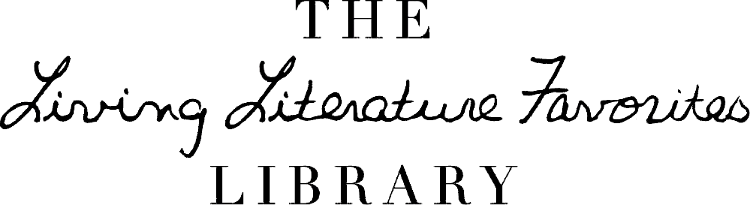
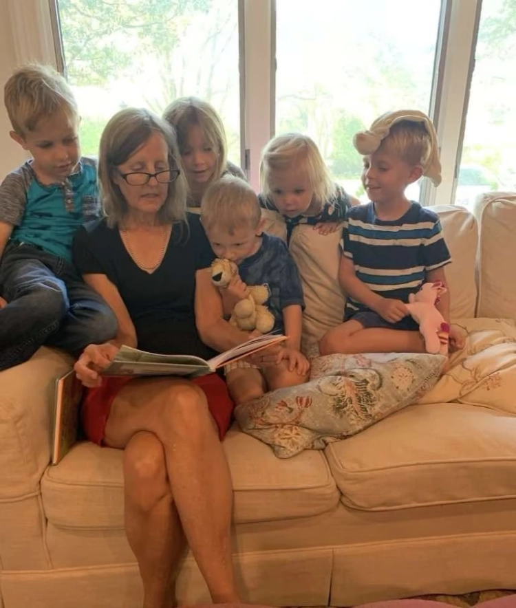

*The Living Literature Favorites Library, Dallas, TX, in honor of Lisa Lindsey Fulmer. Librarian: Elizabeth Cunningham.*

Several years ago, mom and I had a few conversations about starting a library. She had a wealth of knowledge about the best children’s literature, and I had a dearth of books. Mom and I never got very far on our pie-in-the-sky idea. She did bring me a load of books from Half Price Books to start our library, but beyond that, we didn’t really know how to start or how to proceed once we started. Where would the library be, when would it be open, what books should we focus on? How would it even work? All these questions had no clear answer and the library idea just never went anywhere.

*Lisa Lindsay Fulmer reading to her grandchildren*

In 2021, mom passed away unexpectedly. She had battled cancer in 2020, and was cancer free, but, weakened by the treatment, she was unable to recover from respiratory infection. As we considered where to direct people who were eager to give a memorial gift, the idea of a library resurfaced. It happened very quickly, and there was still no plan and no answers to any of the same old questions, but my dad and my sisters and I felt confident that the Lord was at work, and we have seen the Lord at work every step of the way.

Mom had some books, but she wasn’t really a collector, and I am not a shopper, so the Lord provided several of mom’s friends who were willing to help me shop. We came up with a list and started buying, with the lofty goal of having 3,000 books by the end of the year. The funds were available because our church’s foundation helped us collect donations long before our non-profit status was established. As my extra bedroom began to fill up with books, we needed shelves. Again, the Lord provided. Our church’s recent building expansion had resulted in a whole library full of orphaned shelves, which they generously offered us. So with shelves and books, it was time to get started processing. We started by protecting all the book jackets, and for weeks, a team of ladies came and helped me cover books.

Then came our windfall, a longtime friend of mom and dad turned out to also be friends with a homeschool mom/book collector here in Dallas. This sweet mom had felt the Lord’s nudge to downsize her collection, and she had been lovingly culling and boxing up her books for weeks, planning and dreading a great big sale. Our mutual friend heard about our library project and gave us a call. In the end we bought all the books from her—filling a flatbed and two vans with boxes. The task changed from covering book jackets to picking through those books box by box to keep what we wanted and to sell the rest. By the time we were done with that, our shelves were mostly full and we had 4,000 books. Each book needed labels, stamps, and data entry—about a 5-10 minute process for every one of the 4,000 books. Our faithful team of weekly helpers tackled the task, and a few evening parties of my homeschool friends, mom’s creative homemaker friends, and mom’s family helped also. We had our library ready for patrons in February, 2022, one year after mom’s passing.

We are so grateful for the truly unbelievable ways the Lord has provided for us through the Library, and we are excited to keep adding to our collection so that those families who join the library can have an excellent collection of Living Literature Favorites. We chose this name, first of all, because it is mom’s initials: LLF. If you had known mom, you would know she would be mortified by us putting her name on this project, and we did refrain from calling it Little Lisa’s Library or something cute like that. But, sorry mom, we *are* doing all this because of you. So we used mom’s initials in the name, and we used a sample of mom’s handwriting to create the logo—the letters on our logo all actually came from Bible verses mom had copied. A graphic designer friend scanned them in and used his wizardry to give us the words “Living Literature Favorites” in mom’s handwriting. Living literature refers to books that are inspiring, enduring, and engaging, full of beautiful language and ideas. And we love the word “favorites,” because we don’t aim to have every book, indeed we don’t have room, but we do want to have a room of the very best. I hope you’ve seen in this story how much the Lord has done and how many people he has employed in the work. We are grateful because the Lord has so clearly given us this work to do, but he has not left us to do it alone. He has been alongside us every step, and has surrounded us with his people. As is always the case when the Lord gives me work to do, I have found his care for me in it. Spending time with mom’s friends and family working on this library has given me many opportunities to hear and tell stories about mom, to remember her, and to be grateful for her faithfulness to the Lord and his faithfulness to her. I am thankful for the friendships the Lord gave mom, and for the new friends he has blessed me and my children with through the LLF Library. The library has chiefly been the Lord’s ministry to me. I pray it will minister to others as well.