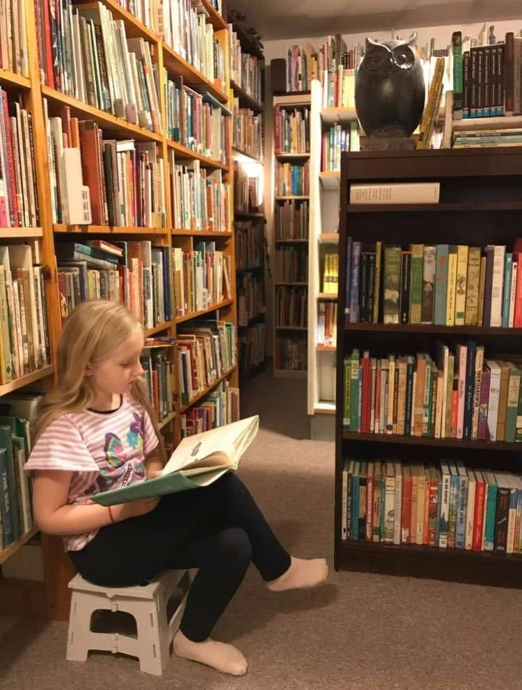
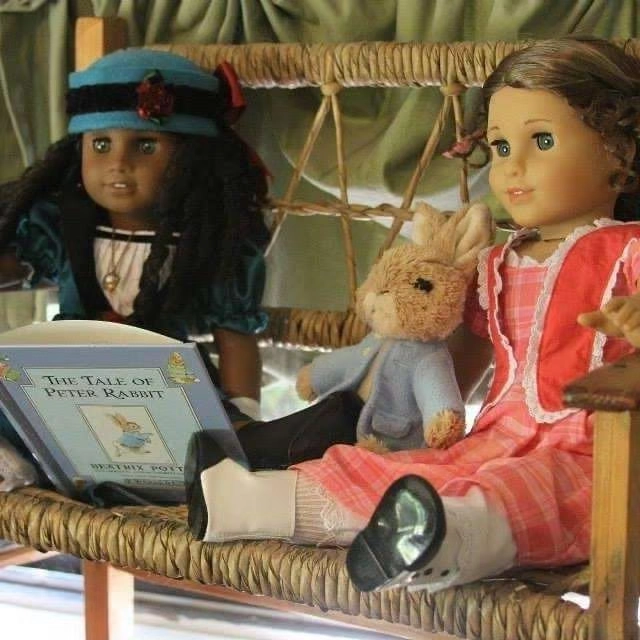
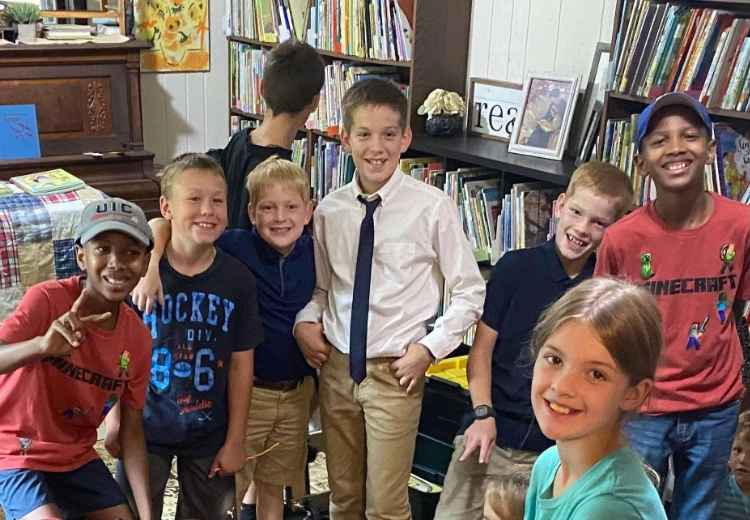

*From Kathleen Seeger, Living Education Library in Edgerton, Wisconsin.*

“Cooperates quite well, but all books have to be hers.” Written by my mother when I was just one year old, this statement lines up perfectly with the memories in my head, that as far back as I can remember, I have always loved books. As a child I learned to read very young and was an avid reader, but while I read many, many books, I have no memory of adults steering me to books that were full of goodness. Left to find books for myself, I understandably found many books that were not edifying to my developing, young mind. In high school and college I read many classics and worthy books, but it was not until I had children of my own much later that I finally discovered the vast world of excellent children’s literature that had slipped right through my fingertips for all those years.

At one time my small hands would have been eager to carry these treasures home from the library, but no teacher or librarian had introduced me to them. Books and the stories they hold have the power to mold young minds and hearts, show them beauty, show them truth, give them hope. As adults, it is really a sacred gift to share story with children and watch as, somehow, abstract lines on pages magically translate into ideas that live on in wonder in the mind of a child.

When my children were babies I delighted in reading them children’s classics like [Goodnight Moon](https://amzn.to/3M6yAGH) and [The Snowy Day](https://amzn.to/3Qqik5S), and I eagerly sought more of these treasures that were still hidden from me. Although the internet was fairly new at the time, I was able to find lists of excellent living books from other homeschooling mothers such as [Carole Joy Seid](https://www.carolejoyseid.com/), Valerie Jacobsen, [Jan Bloom](https://booksbloom.com/), and Liz Cottrill, and our home library rapidly expanded. For a brief time I tried to find many of the books in the public library system, but more often than not they were not there, so another out-of-print book made its way into our home collection.

As the years passed, the number of children in our home grew, and so did the number of books in our home. While I began collecting these books for my own family, at some point I realized there was really no way our family could ever actually read all of these wonderful books. But what a blessing they were! These books really are a cultural heritage from a time that books published for children were written by authors who had passion for, and expertise in, their topics, and were written with respect both for children’s intellect as well as respect for their childhood experience, preserving that joy and innocence that is all too quickly lost.

I had heard of several ladies who had begun private lending libraries for homeschool families, and while it just seemed the craziest idea, it also seemed the loveliest idea, to connect these worthy books and their worthy ideas to the children whom God had created the stories for. To help other mothers find these books for their own children with so much less time and effort than it had taken me, and more importantly, to put these books that had slipped through my fingers as a child, into the hands of children today.

After thinking and praying for several years, a homeschool mentor asked me to sponsor a conference for her near my home. It just seemed as if the Lord had given me an opportunity to share about my library and opened a door for me to walk through, if I desired. So I prayed, and prayed, literally up until the morning of the conference, but when the Lord opens a door for you, how can you not walk through it? And so, the [Living Education Library](https://www.facebook.com/LivingEducationLibrary) was officially born that day in 2014.

It does require a significant amount of time, effort, and sacrifice from my family to operate the library, but looking back on the number of families and children who have come through my doors and brought hundreds of books back to their homes each month, the impact on those young lives cannot be overlooked. After years now of lending books, the very thing that gives me the greatest joy is seeing the anticipation on a child’s face when they come to ask me, “Mrs. Seeger? Can you help me find a book?” and I am able to answer, “Why, yes. Yes, I can.”