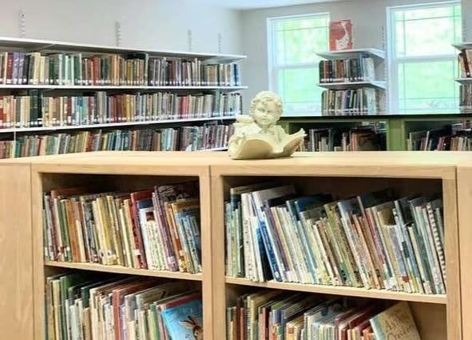
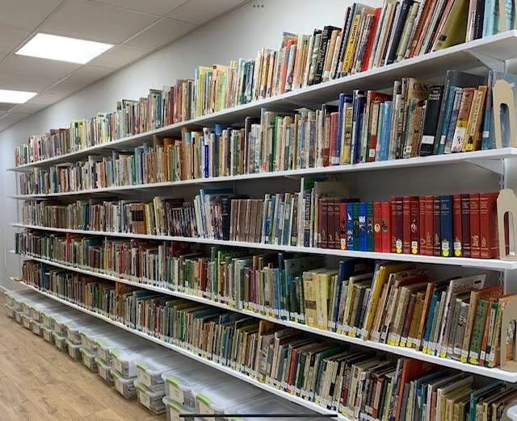

“Robin, have you ever thought about opening a library?” That simple question, asked on a hot, muggy day in August, 2001, changed the trajectory of my life and the lives of the families who would someday walk through my library door. My husband, 10-year-old son, and I were attending a living books gathering “on the back side of nowhere” in southwest Tennessee. One of the attendees was [Michelle Miller Howard, owner of an incredible private library in Michigan](https://plumfieldandpaideia.com/librarian-notices-michelle-howards-library-journey/) and author of Truthquest History. While talking with Michelle about my book collection, numbering around 2,000 volumes at the time, she asked me this question... and my life has never been the same.

From that moment forward I became obsessed with adding every living book possible to my collection to share with the children of my community. Sometimes fear and doubt would crowd my thoughts as boxes of books towered around me, but I persevered and books kept coming to me from every possible direction. Shortly after this fire was ignited, I was presented with what I call my confirmation. I heard of a book sale in Knoxville, Tennessee, of thousands of discarded books. Two homeschool moms came upon a large truck full of books thrown out by the Knoxville public school system. The men were about to put the books in the dumpster when the moms jumped out and said, “Please! You can’t do this! We will buy these books.” They rented a U-Haul, took those books to their basements, priced them from .25 to.75 each and hosted a sale. Oh, what treasures I found! My collection more than doubled with that sale as I hauled three packed van loads home. I still have many books bearing the colorful round price stickers as a reminder of God’s provision that day.

I was so anxious to get my library up and going, but as often happens, life got in the way. We purchased the small-town pharmacy my husband had worked at since high school in 2002; another son was born in 2003; and we moved later that same year. This house had a small furnished apartment in the basement which I earmarked as the future library. I had to wrestle it away from the men of the house, however, because they wanted it for a recreation area. In 2007 we took in two exchange students from France who became like sons to us. They took a special interest in the project of mine and began literally turning my house upside down as they carted the contents of the apartment up to the third level of the house, and the boxes of books from the third level to the basement apartment. Yes, it was as chaotic as it sounds. They helped set up bookcases and load the books onto them. By the time they went home in early June, the library was ready to open. [Children’s Legacy Library](https://www.childrenslegacylibrary.com/) officially opened its door on June 9, 2008 in our small, historic town of Rogersville, Tennessee.

In 2010 we added another son from China to our family. My boys have grown up with these books. Almost every day I’d hear, “Momma, do we have a book about ______?” They looked forward to library days and the Five in a Row story times we hosted for many years. I’m so thankful they’ve had these gems at their fingertips throughout their lives.

I love getting to know each child who comes through my door. Hannah loves biographies, Jane Austen, and Cherry Ames. Calvin is building fluency by devouring books by Clyde Robert Bulla. Rebekah has read every book on birds I own. Zeb camps out in the handicrafts section. Anthony will challenge me by asking for books on the most obscure topics. Watching these young people grow, and their hearts and minds expand, is one of my greatest joys.

Library operations have evolved over the years. I began operating with a pretty vigorous schedule, being open many days a month, and offering Five in a Row story time once a month. As time went on, however, and my boys’ activity schedules became more intense, I had to back off to two or three days a month. This schedule has worked well, and families have adjusted.

For the past 15 years I have charged fees based on the parts of the library families wished to utilize. For example, Five in a Row was \$50 per year. Shelf books were \$75 per year. The annual fee to use the entire library was \$100. This year, however, I am streamlining my fee which will now be \$75 annually for the entire library.

Over the years the library grew to over 18,000 volumes. Life was full of homeschooling, owning the pharmacy, farming (including milk cows, chickens, garden) and running the library. Then, on January 2, 2020, my husband and I went out to milk our cows as usual, having no idea that it would be the last time. By 4:00 that afternoon he would be dead of a massive heart attack. That night, as my boys and I were weeping in one another’s arms, my 6’4″, 16-year-old son picked up our current read aloud, placed it in my hands... and we read.

A lot has changed since that tragic day. We are no longer farming. The pharmacy is closed. My boys have graduated, and after 27 years I am no longer a homeschooling momma. I purchased another home not far from my former one. I remodeled and expanded a detached garage on the property to house the library which is larger than the tiny apartment that served us for so many years. We moved this week (May, 2023).

Children’s Legacy Library will celebrate its 15th anniversary on June 9, 2023 in its new location. God has been faithful to preserve this library through so many trying times. It continues to grow and expand its outreach. I’m thankful for the seed that was planted over 20 years ago on the backside of nowhere. It has grown up and provided nourishment to so many young minds in the form of living ideas through living books. May the legacy continue.

Find Robin Pack and her library on Facebook at Children’s Legacy Library and Instagram at childrenslegacylibrary. You can also check out [her library website, Children’s Legacy Library, a library serving East Tennessee.](https://www.childrenslegacylibrary.com/)