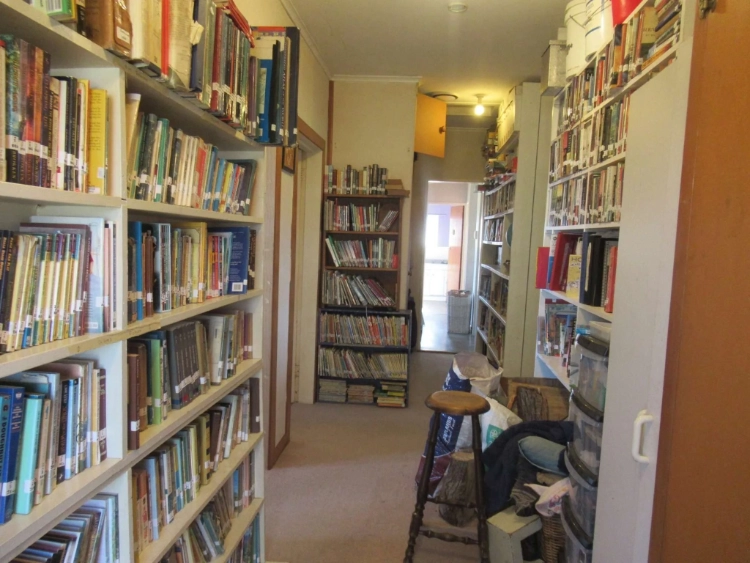
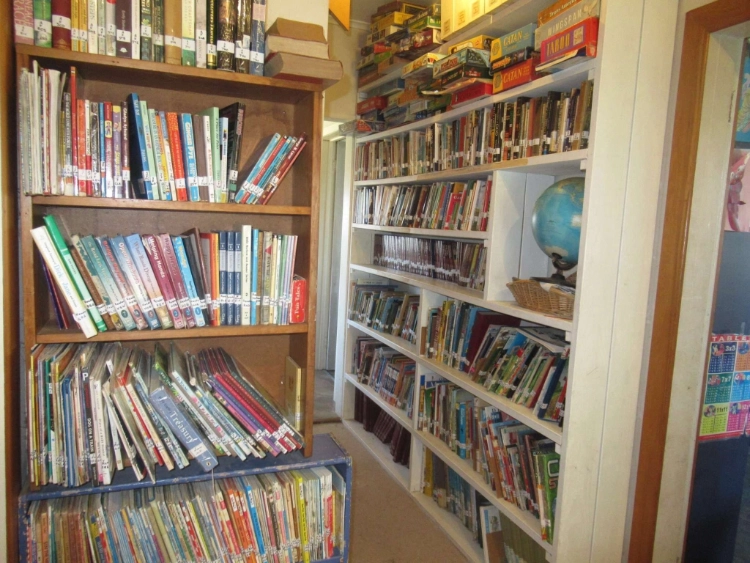

I grew up in Michigan, and was one of the earliest homeschooled children in that state–in fact, my dad was threatened with arrest because I didn’t go to school. He was never prosecuted, but the knowledge that it could happen was part of our lives until about the time I graduated from high school, when homeschooling became legal in Michigan.
After my husband and I were married, we lived in Michigan for twelve years and then moved to New Zealand with our oldest six children. We have homeschooled them all the way through, as I was. Since moving here, we have had three more children and one of the older ones died.

My mom taught me to read when I was three, and I remember the thrill of reading an entire Laura Ingalls Wilder book in one day when I was six or seven. My favorite place to go was the library, and I always read the three books I was allowed to check out within a day or two, then read everyone else’s books, too. I remember being very disappointed on my first day of first grade. Mom gave me my first primer, and I was excited to get to read. What a disappointment that the first lesson was one word: God. I have been a bookworm since I can remember, and loved to show off when I was about five or six by reading a German primer to visitors.

I started collecting books as soon as I had some pocket money. The only thing worth looking at in the local Goodwill was the book shelf! By the time I got married, I had hundreds of books, and probably well over a thousand when we decided to move to New Zealand in 2009. I had to prune down our collection to make the move, but brought about 20 banana boxes of books along. I had started homeschooling my children with Sonlight Curriculum, so of course we needed books! I still spend a lot of money on books. At this point, we live in an area with a very dismal selection of books in the small local library, so I have a great excuse to collect books for my children!

I think I first heard of private lending libraries from someone who started her own here in New Zealand and offered her services on a homeschool Buy/Sell group on Facebook. I may also have, by then, found LibraryThing and seen that they support small private libraries.

I discovered LibraryThing in January 2016 and cataloged all our books; that is summer here, so I had a little spare time while we weren’t in the middle of homeschooling. A year or two later, I got the idea that we could share our books, since I had a way to track loans, so I wrote [a page about our library and my idea on my blog](https://lotsofhelpers.com/our-library/) and started offering to loan books when people would ask for them on the homeschool buy/sell page for New Zealand. As I learned how to build and share our library, I used LibraryThing and the associated TinyCat catalog. Otherwise, it’s just been trial and error. Our library consists of shelves lining both walls of the wide hallway in the middle of our little old house. Currently, we have nearly 3,000 books, and I’m hoping they don’t push the piles down into the ground under the house!

The library is very low-key. A few friends come and borrow books occasionally, especially when we have the homeschool group meetings here. Last year, my daughter helped me inventory all our books and made sure what we have matches the records in LibraryThing, and we put labels on the spines so we can easily find them. She also designed stickers to put inside with our name and phone number/email address. She helps me when someone borrows a stack of books, and we both pick out books when someone asks us to surprise them with good books for their family. The rest of my children just read the books!

We’re open when we’re home. Very few people use it, as I said, so it’s no problem. I mail books to people who request them, after they pay for the postage. Eventually, if the books haven’t come back, I ask for them back. I do not charge fees, other than the postage fee.

I have the books entered in LibraryThing, with tags for each book to help us find subjects. The tags also include which shelf the book is on, and which level of Sonlight they are used in. We have shelves for: Junior Fiction, Junior Biography, Junior History, Junior Geography, Junior Nature, Junior Science, Junior Art, Junior Miscellaneous, Readers, Easy Readers, Picture Books, Adult Fiction, Adult Nonfiction, Adult Biography, Adult History, Adult Miscellaneous, Family, Theology, School, New Zealand Junior Fiction, New Zealand Biography, New Zealand Picture Books, New Zealand Geography, and New Zealand History. This designation is in the tag in LibraryThing and on the label on the book, with the first three letters of the author’s surname or the name of the subject of the biography.

When it comes to adding books to our library, if I think we will be interested in the book and it doesn’t cost much, I get it. If it doesn’t come close enough to our family’s standards, it goes. If we need a book for school or I see one advertised that sounds like it will enrich our family, I may buy it new. We enjoy a huge variety of books, so it’s hard to say exactly how we decide what makes a good book. A book that enriches our lives, that we enjoy, and that does not include anything s\*xually explicit or overly violent, and does not include too much bad language, is probably a good book. We read aloud every day from as many as ten different books to various age levels and on a wide range of topics.

To those who are considering starting their own library, I would say, figure out where to put lots of bookshelves! Be sure to use LibraryThing to keep track of what you have, and don’t forget to check books out to people when you loan to them.