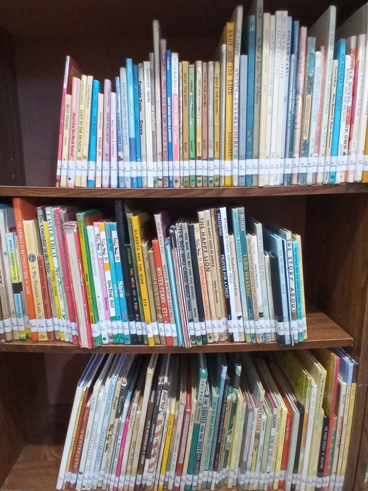
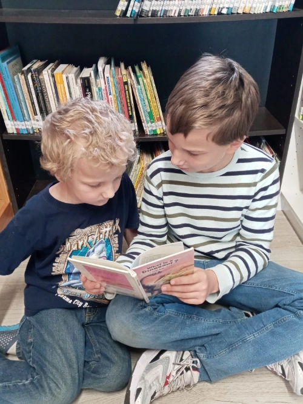

[Covenant Family Library](https://www.facebook.com/covenantfamilylibrary) is located in Martinsburg, West Virginia. Elizabeth Jones is the librarian

<iframe data-testid="embed-iframe" style="border-radius:12px" src="https://open.spotify.com/embed/episode/33C8J4i1nkUxUz9Ee0cs6P?utm_source=generator&theme=0&si=b9e7ac7763464f33" width="100%" height="352" frameBorder="0" allowfullscreen="" allow="autoplay; clipboard-write; encrypted-media; fullscreen; picture-in-picture" loading="lazy"></iframe>

I went to my first library sale when I was about nine. A family we were friends with invited us to join them for their day trip to the annual book sale in Henderson, NC, three hours away. We ended up going every year up through the year I met my husband. There were other, more local sales that we faithfully attended, but that was the big one that I saved up for all year. My younger brothers were really hoping I would get married and take all my boxes of books with me; they planned to set up a pool table once the space was freed up in the basement.

When I married Daniel, he already had two thousand books and I had three, so we knew we were a match made in heaven. What I didn’t realize was that I had just married into a family that believed in Projects. The bigger the Project, the better, and ideally there would be no actual end in sight. So when I was at loose ends in a new town with no babies yet, and Daniel kept telling me I needed a Project, I didn’t know how BIG he meant.

Before I married I attended the same church as the ladies who run [Living Books Library](https://www.livingbookslibrary.com/), so I had been there a couple of times and was familiar with the concept. I thought of it as something that I could possibly do years from now, after I had finished homeschooling. Daniel, however, thought I should go ahead and get started with the books we already had. Even if we didn’t get any members, it would be a fantastic resource for the baby we had by then.

I got in touch with Liz and Emily Cottrill (now Emily Kiser) and asked how to get started. They got me connected to the Yahoo group for private lending libraries (now at groups.io), where I became acquainted with Kristi Stansfield, who got me started going to the Booksaver warehouse sales in Hagerstown. I attended the local homeschool conference in 2014 as a vendor: “Hello! I’m going to have this library in the fall. . . It’s going to be great. . . No, you can’t see it yet.
”
We set up bookcases at one end of our walk-in basement, the end with the door. Over the years the library space worked its way around until it took up two thirds of the basement. My husband built nice brick steps to get people safely down and around the house, but on snowy days I had people come in the kitchen door and down the basement stairs so they wouldn’t slip and die. Our one bathroom was on the main floor, so anyone who needed it got to traverse the entire house. I had a baby monitor set up for when my kids were napping, but it wasn’t reliable, so I would occasionally come to a growing realization that someone was screaming upstairs.

We bought my husband’s grandparents’ house in 2020 and converted the garage into the new library space. We moved on July 4th, but the library wasn’t ready yet. I would have members make an appointment to meet me at my old house to borrow books. Thankfully, it was only ten minutes away; unfortunately, we only had one vehicle, so I had to drive Daniel to work in order to have the car. We moved the books in early 2021, just as I found out I was pregnant with number three, so while I could pack boxes, I couldn’t lift them. I had three member families who went above and beyond the call of duty to get the library moved.

Over the years I have had between three and fifteen member families. I still don’t have bar codes, so I look up each book in my database to check it out, and then type up a list of books borrowed to email to each member after they leave. I’ve had families that only borrow off their curriculum list, and families that stagger out with a bin of 60+ books. I’ve had families that join but never actually show up, and I’ve had families that barter for their membership.

I hope this library will last forever. I hope my daughter or a future daughter-in-law will be ready to take over when I can no longer cope. All three of my children love books and love our library, so I think we’re set up for success.