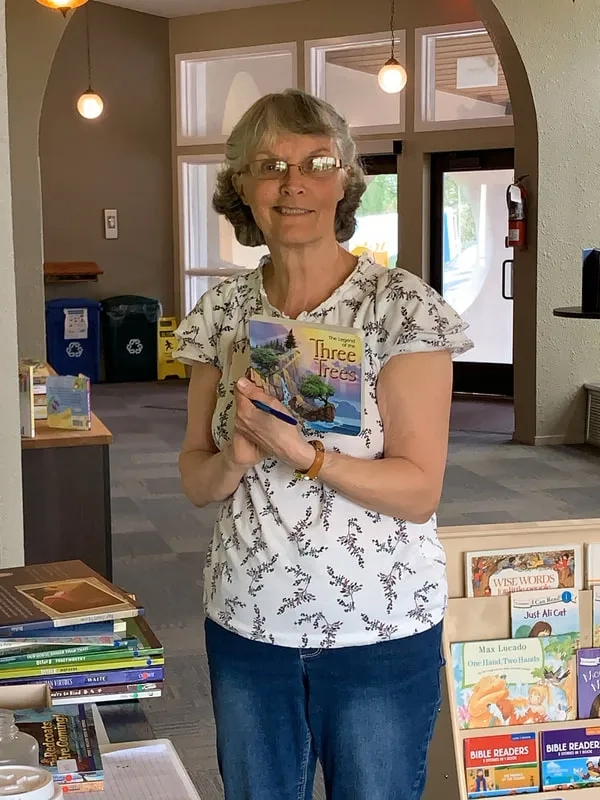
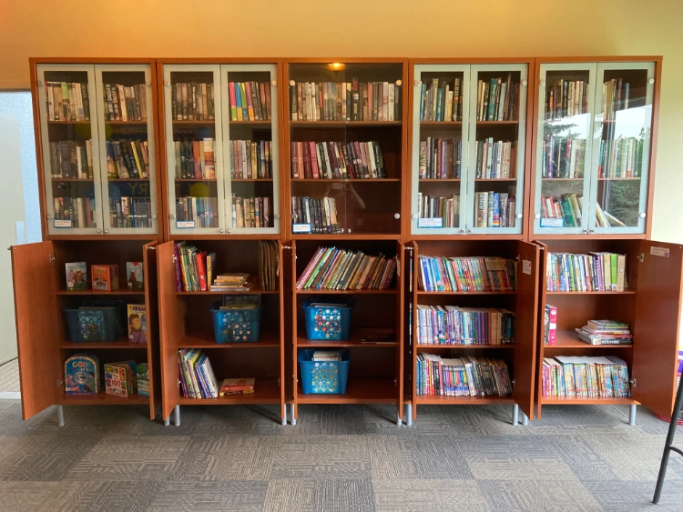

*From Marie Vautour, Kids Christian Library, Calgary, Alberta, Canada*

I recently retired and was asking God for guidance on how to spend my retirement years in useful service for Him. I attend a ladies’ Bible study with young moms and they were talking about the latest news in Calgary libraries and about drag queens reading to children. Mom after mom chimed in about how they just can't go to the public library for their children without pre-reading the books that the children have picked up.
In our city there are a few large churches with libraries so I thought if I could volunteer one day a week in these libraries and that would be helpful for moms who don't attend those churches to access the books. The staff at the churches said no. I went to my home church and asked if I could start a childrens library and their response was---not interested.

Maybe I heard God wrong in this endeavour, so I decided I would just buy some books and give them to parents. While I was considering that idea, I went to my second Bible study at the original church. (I was really in bad shape after two years of covid and no interaction with people.) I discovered that this church had a library but no one was managing it. I put forth my idea to house the *Kids Christian Library* in the church shelving to the church council, and they approved it! Rent free!

Fast forward two years, over 1500 books, and fifty patrons, and I'm grateful to God for his provision! Over half of the fifty patrons are regulars. Parents have expressed how blessed they feel to have this library available to them and that blesses me!

